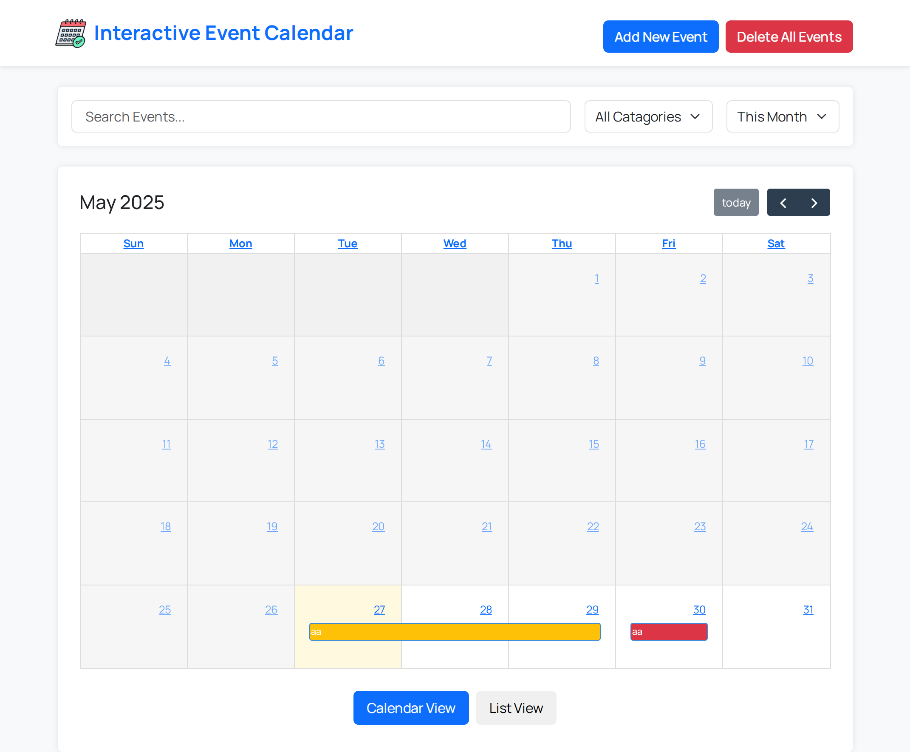
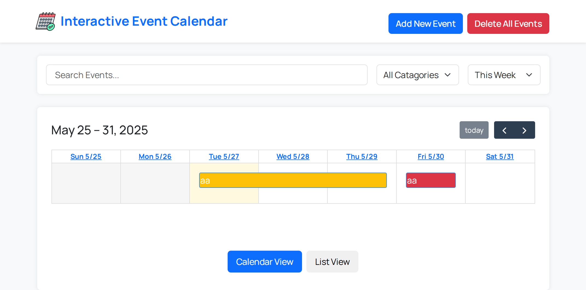
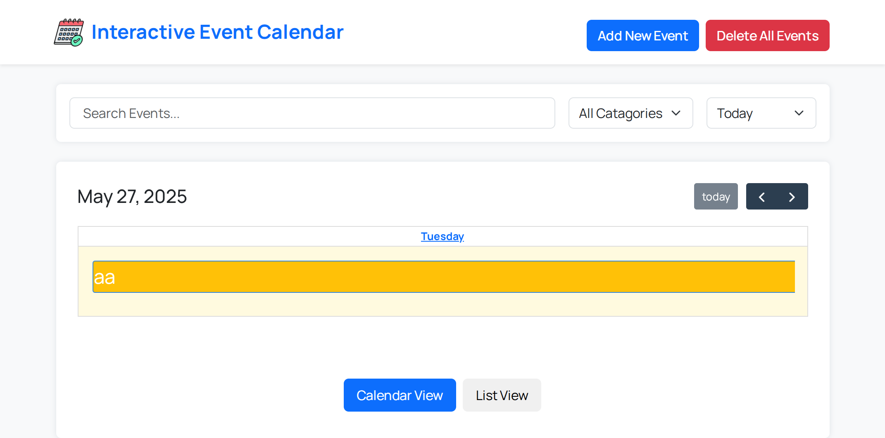
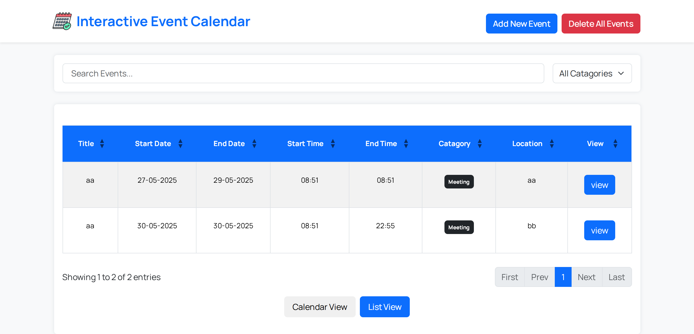
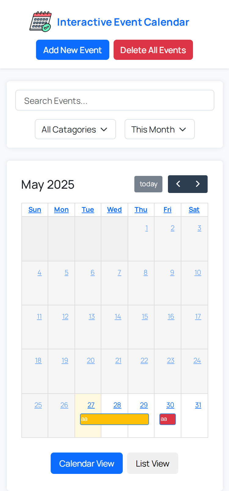
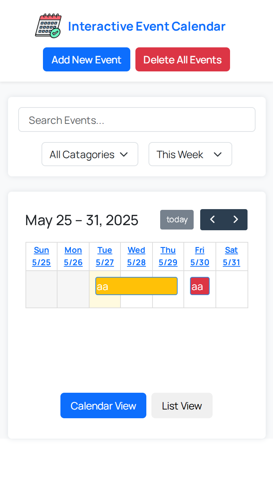
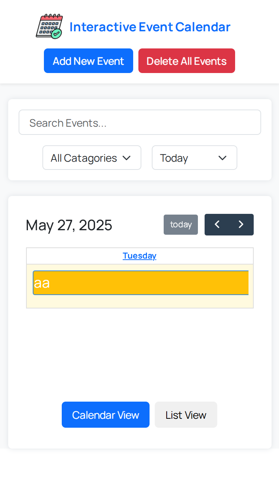
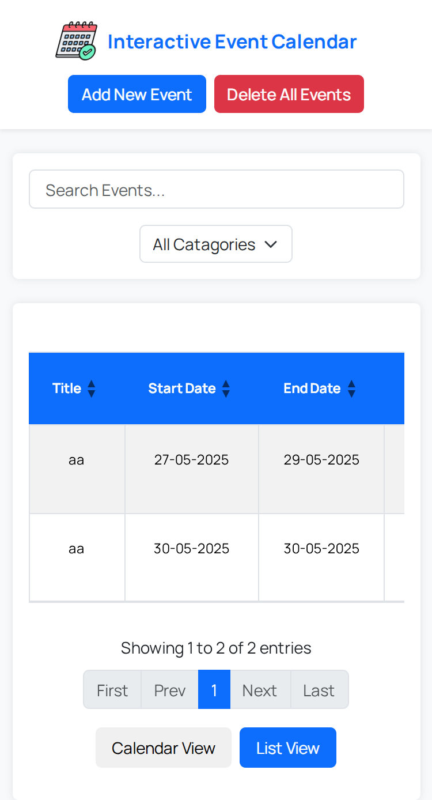

# 📅 Interactive Event Schedular 


This is a Simple, Responsive Interactive Event Schedular that is riched with features. It lets users add upcoming and ongoing events and see them both as in **Calendar view** and in **List view**.

## 🚀 Demo

🔗[Live Demo](https://tamalpakrasi.github.io/Interactive-Event-Schedular/)

## 🖼️ Screenshots (click on image for Preview)

##### 💻 Desktop/Laptop

<p>
<a href="https://raw.githubusercontent.com/tamalpakrasi/Interactive-Event-Schedular/main/Assets/Screenshots/Calendar-Desktop-View-Month.png">
 
</a>
<a href="https://raw.githubusercontent.com/tamalpakrasi/Interactive-Event-Schedular/main/Assets/Screenshots/Calendar-Desktop-View-Week.png">
 
</a>
<a href="https://raw.githubusercontent.com/tamalpakrasi/Interactive-Event-Schedular/main/Assets/Screenshots/Calendar-Desktop-View-Today.png">
 
</a>
<a href="https://raw.githubusercontent.com/tamalpakrasi/Interactive-Event-Schedular/main/Assets/Screenshots/Table-Desktop-View.png">
 
</a>
</p>


##### 📱 Mobile

<p>
<a href="https://raw.githubusercontent.com/tamalpakrasi/Interactive-Event-Schedular/main/Assets/Screenshots/Calendar-Mobile-View-Month.png">
 
</a>
<a href="https://raw.githubusercontent.com/tamalpakrasi/Interactive-Event-Schedular/main/Assets/Screenshots/Calendar-Mobile-View-Week.png">
 
</a>
<a href="https://raw.githubusercontent.com/tamalpakrasi/Interactive-Event-Schedular/main/Assets/Screenshots/Calendar-Mobile-View-Today.png">
 
</a>
<a href="https://raw.githubusercontent.com/tamalpakrasi/Interactive-Event-Schedular/main/Assets/Screenshots/Table-Mobile-View.png">
 
</a>
</p>

## 🌟 Features

- ✅ Adding new Events and Editing old Events
- ✅ Calendar View and List View
- ✅ Deleting all or indiviadual Events
- ✅ Search for events through Search bar
- ✅ Sorting/Filtering events
- ✅ Responsive layout in different Screen Sizes
- ✅ Auto Removal of Expired Events

## 🌐 Technologies Used

- **HTML5, CSS3 & JavaScript**
- **Bootstrap 5.3.5**
- **jQuery 3.7**
- **jQuery-UI**
- **FullCalendar**
- **DataTables**

<p>


</p>

## 🔰 Getting Started
#### 🎯 Prerequisites

- Web browser (Chrome, Firefox, Safari, Edge)
- Text editor (VS Code, Sublime Text, etc.)
- Live server extension (optional, for development)

#### 📥 Installation

1. Clone the repository:

```bash
git clone https://github.com/tamalpakrasi/Interactive-Event-Schedular/
```

2. Navigate to the project directory:

```bash
cd Interactive-Event-Schedular
```

3. Open index.html in your browser or use a live server:

```bash
# If using VS Code with Live Server extension
# Right-click on index.html and select "Open with Live Server


#In mac-OS
open index.html

##In Linux
xdg-open index.html
```

```powershell
##In windows
start index.html
```

## 🔄 Usage

##### Adding New Events
- Click on **Add New Event** button
- Fill up the Form propely and click **Save**

or,

- Click on **Calendar View** button
- Click on any date
- Fill up the Form propely and click **Save**

##### Viewing added Events
- Click on **Calendar View** button
- On calendar click on **any Event popup box**

*or,*

- Click on **List View** button
- Navigate to last column of the table
- Click on any **View** button to see the event details

##### Editing Events
- Click on **Calendar View** button
- On calendar click on **any Event popup box**
- Click **Edit** button
- Fill up the Form propely and click **Save Changes**

*or,*

- Click on **List View** button
- Navigate to last column of the table
- Click on any **View** button to see the event details
- Click **Edit** button
- Fill up the Form propely and click **Save Changes**

##### Deleting Events

To Delete one event at a Time

- Click on **Calendar View** button
- On calendar click on **any Event popup box**
- Click **Delete** button

*or,*

- Click on **List View** button
- Navigate to last column of the table
- Click on any **View** button to see the event details
- Click **Delete** button

To Delete All Events

- Click on **Delete All Events** button

##### Searching Events

- Type something on **Search Bar**

##### Sorting/Filtering Events
- Click on any **Dropdown** beside/below **Search Bar**

## 🌳 Project Structure

```text
Interactive-Event-Schedular/
├── index.html          # Main HTML file
├── Assets/
│   ├── images/        # Images and Logos
│   |── Screenshots/   # ScreenShots of page
|   |── styles/
|   |   |── bootstrap-5.3.5-dist/   #bootstrap styles
|   |   |── desktop.css    #CSS file for larger-screen
|   |   |── style.css      #Common CSS file
|   |──scripts/ 
|      |── fullcalendar-6.1.17/    #fullCalendar JS
|      |── script.js     #main JS/jQuery file
|── .gitignore
└── README.md
```

## 🌐✅ Browser Support

<p style="display:flex; gap:15px;">
  
  
  
  
</p>

## 📚 Author

**Tamal Pakrasi**

- GitHub: [@TamalPakrasi](https://github.com/TamalPakrasi)
- Linkedin: [Tamal Pakrasi](https://www.linkedin.com/in/tamal-pakrasi-0224b8338)
- Email: [tamalpakrasi11@gmail.com](mailto:tamalpakrasi11@gmail.com)

## 🙏 Acknowledgement

- Inspired by [FullCalendar.io](https://fullcalendar.io)
- Color Palette [Bootstrap 5](https://getbootstrap.com/)


